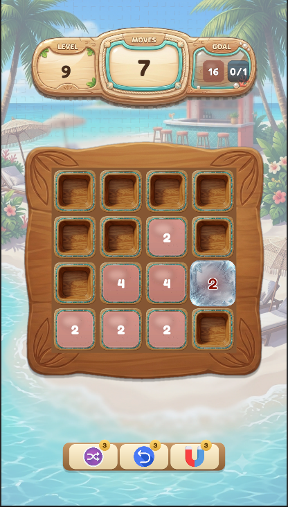
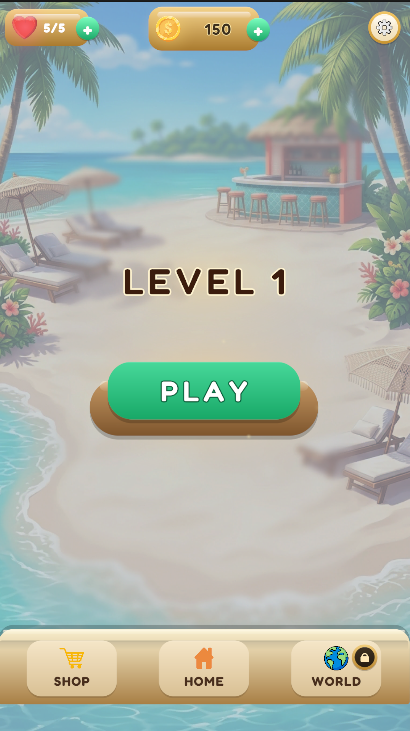
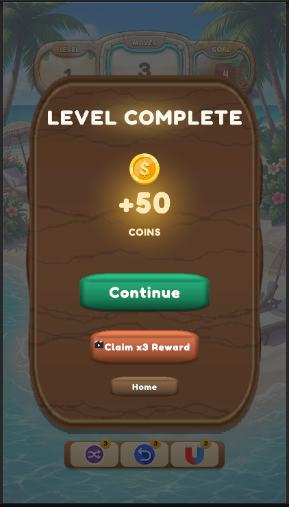
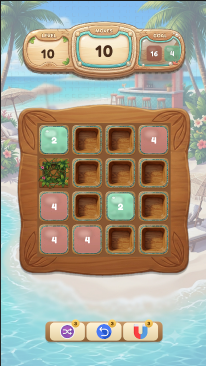

# 2048 Quest

A tropical merge puzzle for Android, built solo in Unity.  
Tiles merge only when **both value and color match** — a single rule change that turns a familiar mechanic into a planning problem.

  
  
  
  

> This is a showcase repository. The full game source code is private — selected systems are included below to illustrate the technical approach and pipeline.

---

## The Problem I Set Out to Solve

Most merge puzzles generate boards randomly. That makes them cheap to produce and impossible to balance: you can't tune a difficulty you can't measure, and you can't promise players that the level in front of them is even solvable.

I wanted the exact opposite. Every level in this game is a fixed, hand-verified puzzle with a known solution and a proven minimum move count.

---

## How Levels Are Made

Levels are neither authored by hand nor generated randomly. They are produced through a structured **generate-and-verify pipeline**:

### 1. Candidate Generation
Tiles are placed in matched pairs so no tile can ever be stranded without a merge partner. Blockers, obstacles, and goals are derived dynamically based on what is actually reachable on that specific board.

### 2. Solvability Proof
A Breadth-First Search (BFS) solver explores the full move tree and calculates the exact minimum number of moves required to win. If it cannot find a solution, the candidate is immediately discarded. This is not a heuristic — a level ships only when its optimal solution is **proven**.

### 3. Quality Gates
A level candidate is rejected if it fails any of these criteria:

| Gate | Why It Matters |
|---|---|
| **No orphan tiles** | A tile that can never merge creates visual noise and frustration. |
| **Not solved at start** | Trivial levels waste the player's time. |
| **No deadly first move** | Every initial direction must leave the level winnable. |
| **Color rule engaged** | Same value with different colors must actually appear. |
| **Tempting wrong move exists** | Without a trap or misdirection, it's a maze, not a puzzle. |
| **Low solution count** | Having too many winning paths means the player stumbles into victory by accident. |

> **Note:** The *"no deadly first move"* gate was critical. A move that quietly renders a level unwinnable is terrible UX — the player continues playing, loses six moves later, and never understands why.

### 4. Difficulty Tuning
Optimal move count is **not** what a player perceives as difficulty. What they actually feel is *how much margin for error they have*. 

Instead of assigning an arbitrary move budget, each level is simulated thousands of times by an **"instinct player"** bot — an algorithm that immediately merges available matches without planning ahead. The move limit is then adjusted until the bot's win rate falls into the exact target range for that stage of progression.

| Levels | Avg. Optimal Moves | Instinct-Player Win Rate |
|:---:|:---:|:---:|
| **1–10** | 2.9 | 70% |
| **11–20** | 4.6 | 32% |
| **21–30** | 5.6 | 26% |
| **31–40** | 6.6 | 25% |
| **41–50** | 7.6 | 24% |

**The Result:** Puzzles become objectively deeper and more complex while keeping player frustration consistent.

---

## Design Principles Learned from Data

* **Introduce mechanics on easy levels:** Early iterations introduced the ice blocker on a level where 2 out of 4 opening moves were fatal. Teaching a new mechanic while punishing exploration is counterproductive. New mechanics now always land on "relief" levels.
* **Buffer is the real difficulty dial:** Two levels with identical optimal move counts feel completely different at +2 vs. +5 spare moves. Depth sets the skill ceiling; buffer sets the emotional experience.
* **Boss levels need generous buffers:** Block-ending levels initially failed their win-rate targets. They now receive significantly more move buffer than their depth implies.
* **Expose blocker requirements visually:** Originally, ice hid the tile underneath it, forcing players to guess which color would break it. Blockers now feature a colored aura and a color-matched numeric indicator.

---

## What's in This Repository

| Path | Description |
|---|---|
| [`solver/Solver.cs`](solver/Solver.cs) | C# BFS solvability solver used in-game by the Shuffle booster system. |
| [`solver/engine.py`](solver/engine.py) | Rule-exact Python replica of the C# game engine logic. |
| [`solver/quality.py`](solver/quality.py) | Quality gate verification and player simulation scripts. |

*The Python engine is a line-by-line replica of the Unity C# core logic. It was validated by independently re-deriving the optimal move counts of all 35 pre-existing hand-made levels — achieving a 100% match rate before generating new content.*

---

## Tech Stack & Tools

* **Game Engine:** Unity 6.3 LTS · C#
* **UI & Animation:** DOTween · TextMeshPro
* **Level Pipeline:** Python (BFS Solver & Simulation Tools)
* **Analytics:** Firebase Analytics · GameAnalytics

---

## Current Status

* **50 levels** fully balanced and shipped.
* Soft launch / Android release in preparation.
